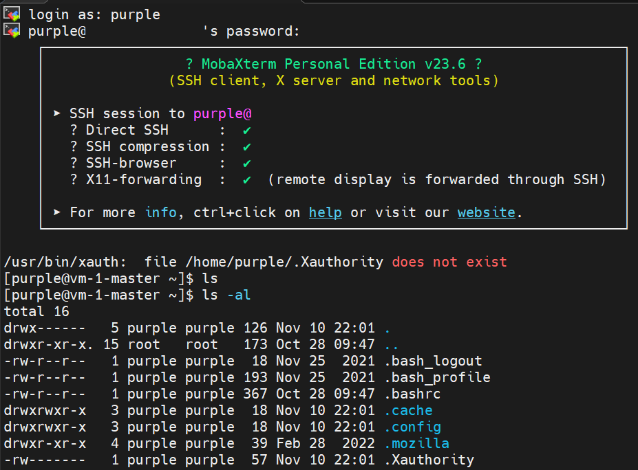
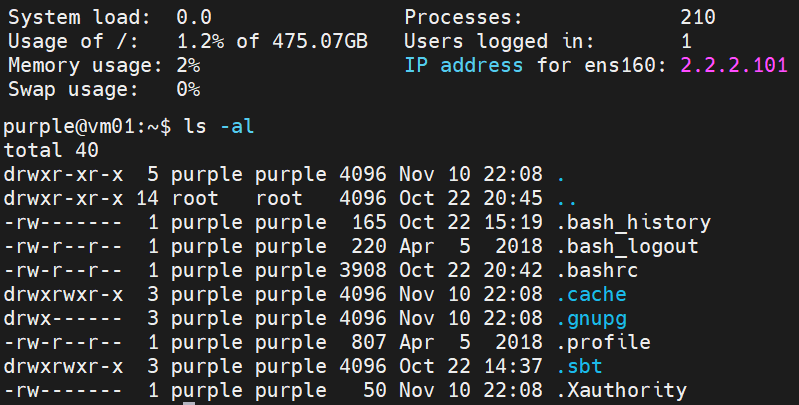
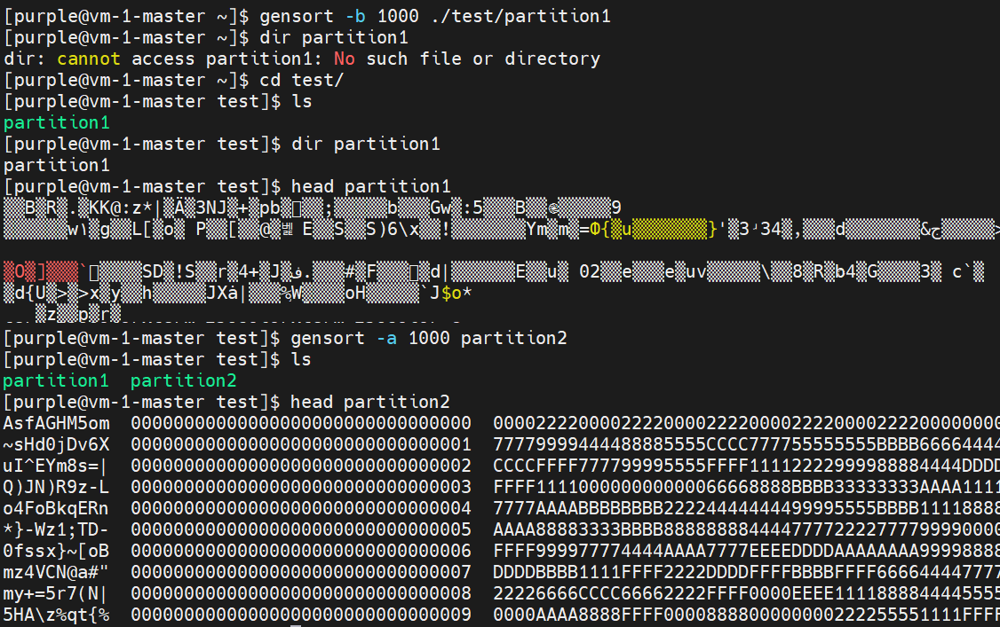

# Progress Report
POSTECH CSED332 project - Distributed Sorting

---

## Week 1

### 프로젝트 목표 인식

**1. Project goal**

이 프로젝트의 목표는 여러 대의 머신에 분산되어 저장된 키/값 레코드를 정렬하는 것이다. 기본적으로 주어진 데이터는 디스크에 저장된 100바이트의 레코드로 이루어져 있으며, 첫 10바이트가 키로 사용되고 나머지 90바이트는 정렬 과정에서는 사용되지 않는 값이다. 목표는 이러한 레코드를 다음과 같은 환경에서 정렬하는 것이다:

####

> - 단일 디스크에 저장된 데이터를 정렬하는 것이 초기 목표이다. 메모리의 크기가 제한된 상황에서, 예를 들어 50GB 데이터를 8GB 메모리에서 정렬할 때는 디스크 기반의 병합 정렬을 활용해야 한다.
> - 그러나, 더 큰 문제는 데이터가 한 디스크에 모두 저장되지 않는 경우다. 예를 들어, 10TB 데이터가 1TB 디스크에 저장될 때, 데이터는 여러 대의 머신에 분산되어 저장된다. 이 경우, 각 머신에서 데이터의 특정 범위(key range)를 담당하여 정렬한 후, 최종적으로 병합하는 방식으로 문제를 해결해야 한다.
> - 최종 목표는 여러 머신과 디스크에서 분산 및 병렬로 키/값 레코드를 정렬하는 것이다. 이를 위해 각 머신은 병렬 처리를 활용해 데이터를 처리하고, 마지막으로 병합 단계에서 다중 코어를 활용하여 성능을 최적화한다.

#

**2. Challenges**

1. __메모리 제한 문제__  
   정렬하려는 데이터가 메모리 크기(8GB)를 초과하는 상황에서 전체 데이터를 메모리로 가져와 정렬하는 것이 불가능하다. 이를 해결하기 위해 디스크 기반 병합 정렬을 사용해야 한다. (데이터를 작은 청크로 나누어 각각을 디스크에서 처리하고, 병합)

2. __디스크 용량 문제__  
   데이터가 디스크에 모두 저장되지 않는 경우. 한 예시로 10TB의 데이터를 1TB 용량의 디스크에 저장해야 하는 상황에서 데이터를 여러 머신에 분산시켜 저장하고 처리해야 한다.

3. __분산 정렬__  
   데이터를 분산하여 처리하려면 각 머신이 자신이 처리할 키 범위(key range)를 알아야 한다. 이를 위해 마스터 머신이 필요하며, 마스터 머신은 각 워커 머신에게 작업할 키 범위를 할당한다. 이후 워커 머신은 해당 범위 내의 데이터를 정렬한 후, 다른 머신과 함께 병합하는 방식으로 진행된다.

4. __병렬 처리의 효율성 극대__  
   각 머신은 여러 개의 디스크를 사용하고, 각 디스크에서 데이터를 병렬로 처리할 수 있어야 한다. 하지만 디스크 I/O의 한계로 인해 정렬/분할 스레드의 수를 제한할 필요가 있고, 병합 과정에서 단일 코어만 사용하는 문제를 해결하기 위해 여러 개의 파티션을 병렬로 병합할 수 있는 방식으로 시스템을 설계해야 한다.

5. __성능 최적화__  
   포르젝트의 성능이 지나치게 느려선 안 되지만, 단일 머신에서 실행하는 것보다 병렬 및 분산 환경에서 훨씬 빠르게 실행되어야 한다. 또한, 마스터 머신이 워커 머신을 순차적으로 처리하지 않도록 하고, 가능한 한 동시에 여러 워커를 관리할 수 있도록 시스템을 설계해야 한다.

#

### 프로젝트 진행 계획

**1. Overall Plan**

프로젝트 수행 단계는 크게 Planning, Coding, Component test, System test로 나눌 수 있으며 Mythical Man-Month에서 
저자의 조언에 따르면 1/3, 1/6, 1/4, 1/4의 시간 분배를 추천하고 있다. 기간이 3일뿐이었던 첫 주(Week 1)와 프레젠테이션 준비 및 예상치
못한 문제 해결 등을 위해 남겨둘 마지막 주(Week 8)를 제외한 기간은 총 6주로, 각각의 단계 수행에 2주, 1주, 1.5주, 1.5주를 
생각하고 있다.

>####
>Week 1: 프로젝트 이해, Git repo 생성 및 팀원과의 일정 조율  
Week 2, 3: 전반적인 프로그램 구조 디자인, 구현 방법 구체화, 핵심 내용은 비워둔 채 전체적인 틀 형성  
Week 4: 각각의 세부 코딩 영역 역할 분배 후 코드 작성  
Week 5: 각자 상대가 구현한 코드에 대한 이해 및 교차 테스트, 디버깅  
Week 6, 7: 전체 프로그램에 대한 테스트, 디버깅  
Week 8: 일정 지연에 대한 대비 기간이자 최종 프레젠테이션 준비 기간  
>####

Planning 단계에서는 생성형 AI의 도움을 받아 프로그램 디자인을 수행할 계획이며, 프로젝트 전체에 대한 큰 그림을 구상해야 할 뿐 아니라
프로그래밍 환경 구축 등의 세팅 또한 해당 기간에 수행해야 하므로 다소 길어질 수 있다. Coding 단계 또한 아직 Scala 언어에 
완벽하게 익숙하다 말하기 어려운 상태이니 지연될 수 있음을 감안해 추후 기간을 조정할 생각이다.

###

<U>Milestones</U>

- Milestone #1
  - test cluster 사용법 숙지
    - master 실행, worker 연결
    - master-worker 간 통신에 사용할 network library 선정 및 공부
  - Sample input data 생성
    - gensort 사용법 이해

- Milestone #2
  - master-worker 통신 프로토콜 구현
    - master-worker 간 통신 확인
    - 메시지 전달 및 error handling 테스트
  - Sampling
    - worker가 master로 sample data 전송하는 strategy 설계
    - master의 sample analyze, data partition decision method 설계
  - Documentation
    - 구현한 코드에 대한 documentation 작성

  ...

#

**2. Schedule for weekly meeting**

프로젝트에 주어진 시간은 이번 첫 주(~24.10.20.)를 포함해 8주(~24.12.08.)로, 구현 요구사항에 비해 그 기간이 결코
많지 않다. 프로젝트의 빠른 진전을 위해 3일 가량의 시간이 주어진 이번 주와 시험기간이 포함된 다음 주를 제외하고 
매 주 2회의 미팅을 계획하고 있으며, 변동될 수 있다.

>< Meetings >
>
>- 10.19.(Sat) : 프로젝트 주제 인식, 향후 계획 작성
>- 10.25.(Fri) : 프로그래밍 환경 구축, 프로그램 구조 디자인
>- 10.29.(Tue) : 프로그램 구조 디자인
>- 11.01.(Sat) : 사용 라이브러리 선정 등 구현 방법 구체화, 클래스 설계
>- 11.05.(Tue) : 코드 영역 분담 및 작성 
>- 11.09.(Sat) : 코드 작성, 진행 상황 확인
>- 11.12.(Tue) : 서로의 구현 코드 설명, 이해 및 테스트
>- 11.16.(Sat) : 코드 수정/테스트/디버깅, 중간 발표 준비
>- 11.19.(Tue) : 중간 발표 준비
>- 11.23.(Sat) : 중간 발표 피드백 수용, 코드 병합 후 전체 프로그램 테스트
>- 11.26.(Tue) : 테스트 및 디버깅, 필요 시 재구현
>- 11.30.(Sat) : 테스트 및 디버깅
>- 12.03.(Tue) : 테스트 및 디버깅, 최종 발표 준비
>- 12.07.(Sat) : 최종 발표 준비

#

**3. Communication methods**

장기 프로젝트의 특성상 팀원과의 지속적인 소통이 필요하다. 연락처 교환 후 카카오톡 메신저를 통해 기본적인 원거리 소통을 수행하기로 하였으며, 
프로젝트 코드 구현이나 관리 등에 어려움이 생겨 추가적인 소통이 필요하다면 위에서 계획한대로 매 주차 정해진 미팅시간에 이를 위한 모임 계획을 
정하는 것으로 생각하고 있다. 전반적인 코드 관리는 github를 통해 이루어질 것이며, 개개인이 구현한 코드 병합 시 충돌이 일어나는 것을 방지하기
위해 미팅을 통해 해당 주차에 진행할 활동의 범위와 역할을 정확히 나누고 각각의 branch를 만들어 관리한다.

#

>#### Next week goal:   
> 프로그래밍 환경 구축, cluster 사용법 숙지, master/worker 테스트 및 network library 학습
> - 김균서: master-worker connection 수행
> - 정용준: network library 활용해 간이 프로토콜 작성, 메시지 전송 등 테스트

#

---

## Week2

### Brainstorming Idea

프로젝트 소개 ppt의 내용을 바탕으로 프로그램의 전체적인 구조에 대한 아이디어를 간단하게 정리하고 작성할 클래스 및 함수에 대한 skeleton code를 작성하였다.

**1. System Architecture**

1. Master Node

master가 수행하는 작업들은 다음과 같다.
- Track and communicate with workers
- Distribute sorting tasks
- Collect results and determine ordering
- Determine the final ordering of data blocks

```Scala
class Master(numWorkers: Int) {
  val workers = new Array[String](numWorkers) // stores IPs of workers

  // Start master node
  def startMaster(): Unit = {
    // implement network code here to handle worker connections
  }

  // Distribute sorting tasks to workers
  def distributeTasks(): Unit = {
    // logic to distribute input blocks
  }

  // Collect results and determine ordering
  def collectResults(): Unit = {
    // logic to gather sorted blocks and determine final ordering
  }

  // Other master methods...
}
```
###
2. Worker Nodes

worker가 수행하는 작업들은 다음과 같다.
- Receive tasks from the master
- Sort local data blocks
- Shuffle sorted datat to appropriate workers
- Merge sorted blocks

```Scala
class Worker(masterAddress: String, inputDirs: List[String], outputDir: String) {
  // Start worker node
  def startWorker(): Unit = {
    // implement network code to connect to master
  }

  // Perform sorting on received input blocks
  def sortInputBlocks(): Unit = {
    inputDirs.foreach { dir =>
      // Read and sort input blocks
    }
  }

  // Send sorted blocks back to master
  def sendSortedBlocks(): Unit = {
    // implement sending logic
  }

  // Other worker methods...
}
```
###
3. Communication

master와 worker 간의 통신을 수행하는 client-server application이 필요하며, 편리한 구현 및 성능을 위해 교수님께서 추천하시는 gRPC with Protobuf를 사용할 계획이다.
이에 대한 사전지식이 없어 사용 방법 등을 숙지 중이며, 다음의 스켈레톤 코드는 ChatGPT를 통해 작성하였다.

```Proto
syntax = "proto3";

service SortService {
  rpc DistributeTasks (TaskRequest) returns (TaskResponse);
  rpc CollectResults (ResultRequest) returns (ResultResponse);
}

message TaskRequest {
  string workerId = 1;
  string inputBlock = 2;
}

message TaskResponse {
  string status = 1;
}

message ResultRequest {
  string workerId = 1;
  string sortedBlock = 2;
}

message ResultResponse {
  string status = 1;
}
```

참고 사이트:  
https://scalapb.github.io/docs/getting-started/  
https://scalapb.github.io/docs/grpc/
###
4. Sorting and Parallel Processing

Sorting 작업은 multiple thread로 parallel하게 수행한다.

```Scala
object Sorter {
  def parallelSort(inputBlocks: List[Array[Byte]]): List[Array[Byte]] = {
    inputBlocks.par.map(block => sortBlock(block)).toList
  }

  def sortBlock(block: Array[Byte]): Array[Byte] = {
    // Sorting logic
  }
}
```

###
5. 데이터 불러오기

프로그램이 다루는 데이터는 저장되어있는 대용량의 key-value pair이며 이를 ASCII/binary format에 무관하게 
불러오고 다룰 수 있어야 한다. 주어진 파일 경로에서 데이터를 읽어오는 역할의 함수를 다음과 같이 구상한다.

```Scala
def readRecords(filePath: String): List[Array[Byte]] = {
  val file = new File(filePath)
  val in = new BufferedInputStream(new FileInputStream(file))
  val buffer = new Array[Byte](32 * 1024 * 1024) // 32MB buffer

  // 읽은 데이터를 buffer에 저장
  Stream.continually(in.read(buffer)).takeWhile(_ != -1).map { bytesRead =>
    buffer.slice(0, bytesRead) // 읽은 만큼의 데이터를 슬라이스해서 저장
  }.toList
}
```

#

>#### Next week goal:
> cluster 사용법 숙지, master/worker 테스트 및 network library 학습  
> gRPC 숙지, 프로젝트 전체의 구조 및 상호작용을 시각화하는 block diagram 등 구성
> - 김균서: 개인 PC에서 환경 구성 후 소규모 dataset 기반 단일 sorting 작업 수행, cluster 작업 테스트
> - 정용준: System Architecture 수정 및 구체화, visualization

#

---

## Week3

이번 주차는 본래 작성할 클래스, 모듈 간 소통 경로, 블록 다이어그램 등을 모두 구상하며 프로젝트 설계 단계를 거의 마무리하고 상황에 따라 구현
단계로 넘어갈 것을 계획하였으나, 팀 멤버 양측이 모두 일정이 생겨 미팅 및 진전을 이루지 못하였다. 따라서 교내 가상 머신 서버 접속을 위한 IP 신청,
방화벽 접근 신청 등 개별적으로 진행 가능한 활동이나, scala 및 gRPC 문법 공부 등 개인적으로 부족한 구현 능력을 향상시키는 것을 위주로 진행하였다.

이외에는 ChatGPT를 사용하여 구현해야 할 간단한 목표나 master/worker 구조를 리마인드해보았다.
- Sampling:  
마스터는 각 워커로부터 샘플 데이터를 수집하여 전체 데이터의 분포를 분석합니다.  
이를 위해 각 워커에서 일정 비율로 데이터를 샘플링합니다.

- Sort/Partition:  
각 워커는 자신의 데이터 파티션을 정렬합니다.  
정렬 후, 각 워커는 정렬된 데이터의 키를 기준으로 분할합니다.
- Shuffle:  
마스터는 각 워커에게 정렬된 데이터를 기반으로 데이터를 다른 워커로 전송하도록 지시합니다.  
데이터를 송신할 워커와 수신할 워커의 매핑을 관리합니다.
- Merge:  
각 워커는 수신한 데이터를 병합하고 최종 정렬된 결과를 생성합니다.  
결과를 지정된 출력 디렉토리에 저장합니다.

```plaintext
+-------------------+                          +--------------------+
|   Master Node     |                          |   Worker Node      |
+-------------------+                          +--------------------+
| - Start Server    |<---gRPC Communication----| - Start Server     |
| - Receive Data    |                          | - Read Data        |
| - Sampling        |                          | - Sample Data      |
| - Send Partitions |------------------------->| - Sort Data        |
| - Shuffle         |<---Results from Workers--| - Send Data        |
| - Merge Results   |                          | - Merge Results    |
| - Write Output    |                          | - Clean Temp Files |
+-------------------+                          +--------------------+
```

#

>#### Next week goal:
> Week2의 목표 그대로  
> 프로젝트 설계 완성하고 파트 분배. 여러 Worker들에 대한 Master의 concurrent handling에 대해 고민.
> - 김균서: Sampling, Sort/Partition 단계에 대한 구체적인 디자인 작성
> - 정용준: Shuffle, Merge 단계에 대한 구체적인 디자인 작성

#

---

## Week4

Cluster center 접근 신청을 완료하고 ssh를 통한 master/worker 기계로의 접속이 가능하도록 개인 환경을 구성해 접속을 테스트해 보았다.
Scala 프로그래밍은 IntelliJ IDEA Community Edition을 사용하고 있었으나 ssh 연결 기능은 유료로 제공하고 있어 MobaXterm을 이용해 수행하였다.
전반적으로 ssh 원격 연결, 그리고 클러스터 서버를 통한 원격 제어 및 프로그래밍에 대한 개념이 없어 이러한 부분에서 다소 시행착오를 겪었다.
아래 그림과 같이 Master 기계에 접속 및 팀에게 할당받은 11개의 worker 기계에 전부 한 번씩 접속해보며 앞으로 다루어야 할 가상 머신 서버의 상황을 확인하였다.



####



이후 gensort 파일을 설치하고 이를 사용해 샘플 데이터를 생성해보며 사용법을 숙지하였다. 현재 binary data로 생성 시 내용이 깨져서 출력되는 현상이 있어
이를 해결해야 한다.




#

>#### Next week goal:
> 프로그램의 흐름을 보여주는 다이어그램 작성...  
> 현재 master/worker 역할에 대한 아이디어를 개별적으로 적어만 두고 체계화하지 못한 상태  
> 다이어그램 형식은 수업 ppt "scala.08"의 18번째 슬라이드 참조
> - 김균서: 가상머신 접속 관련 문제 해결, master-worker 상호작용과 전체 흐름에 대해 고민
> - 정용준: master-worker 상호작용과 전체 흐름에 대해 고민

#

---

## Week5

Master와 Worker의 각 역할과 전체 흐름을 전체적으로 정리하였다.
[Master-Worker.pdf](https://github.com/user-attachments/files/17789295/Master-Worker.pdf)


#

>#### Next week goal:
> 전반적인 프로그램의 흐름을 정리했고, Worker와 Master의 코드 구현을 마쳐야 함.
> 목표는 Master-worker 통신까지 구현하는 것.
> - 김균서 : Master 코드 작성, Master-worker간 통신 코드 작성
> - 정용준 : Worker 코드 작성, Master-worker간 통신 코드 작성
